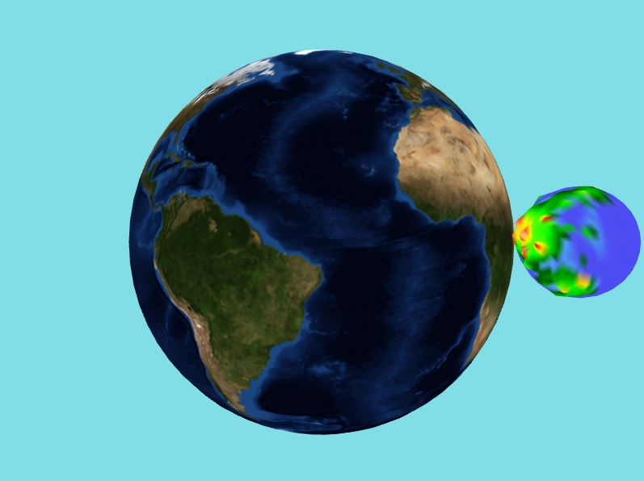

# Earth_with_a_moon
In this program, I will be utilizing the powerful OpenGL graphics library to create a stunning 3D scene of the Earth and its Moon. To generate a realistic texture of the Moon, I will be implementing the Perlin noise algorithm, which is widely used in computer graphics to create realistic textures and patterns.

The Perlin noise algorithm is a type of procedural noise function that produces a random but smooth and coherent pattern of values. By manipulating the parameters of the Perlin noise algorithm, I will be able to generate a wide range of textures and patterns for the Moon, such as lands, mountains, and oceans.

The following features will be implemented:
 - loading models from files in the OBJ format, which will include information on position, texture coordinates, and normal vectors.
 - loading 2D textures in bitmap format onto a spherical object, using an image of the Earth.
 - implementing 3D procedural textures in GLSL shader using Perlin noise functions, with the ability to layer textures.
 
The Earth object can be rotated using left/right arrow keys.

To compile: make  
To run: ./main

Here is a visualization.  

